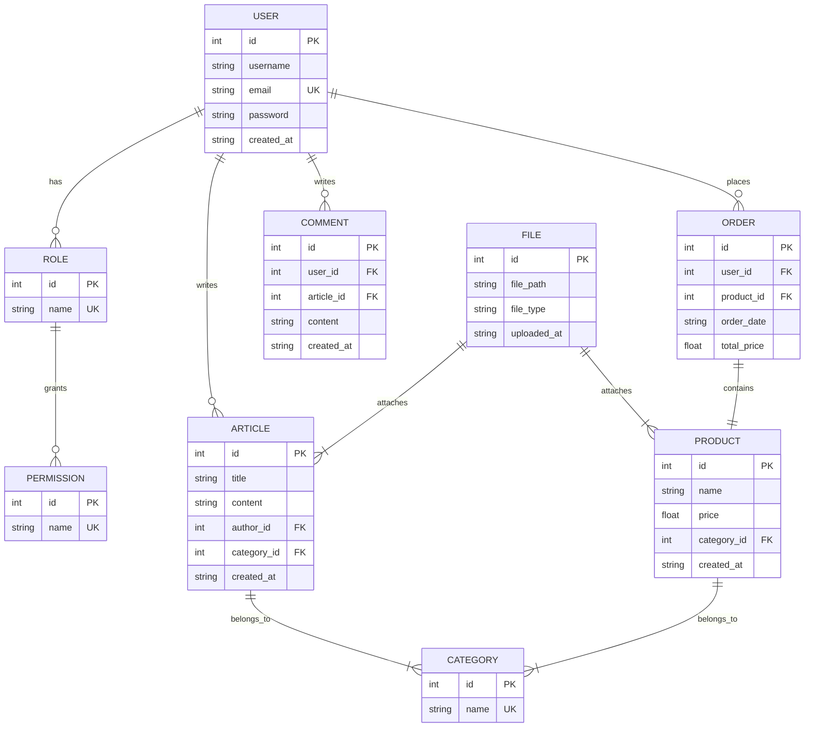

```mermaid
erDiagram
    USER {
      int id PK
      string username
      string email UK
      string password
      string created_at
    }

    ROLE {
      int id PK
      string name UK
    }

    PERMISSION {
      int id PK
      string name UK
    }

    ARTICLE {
      int id PK
      string title
      string content
      int author_id FK
      int category_id FK
      string created_at
    }

    PRODUCT {
      int id PK
      string name
      float price
      int category_id FK
      string created_at
    }

    CATEGORY {
      int id PK
      string name UK
    }

    COMMENT {
      int id PK
      int user_id FK
      int article_id FK
      string content
      string created_at
    }

    ORDER {
      int id PK
      int user_id FK
      int product_id FK
      string order_date
      float total_price
    }

    FILE {
      int id PK
      string file_path
      string file_type
      string uploaded_at
    }

    USER ||--o{ ROLE : "has"
    ROLE ||--o{ PERMISSION : "grants"
    USER ||--o{ ARTICLE : "writes"
    USER ||--o{ COMMENT : "writes"
    ARTICLE ||--|{ CATEGORY : "belongs_to"
    PRODUCT ||--|{ CATEGORY : "belongs_to"
    USER ||--o{ ORDER : "places"
    ORDER ||--|| PRODUCT : "contains"
    FILE ||--|{ ARTICLE : "attaches"
    FILE ||--|{ PRODUCT : "attaches"

```
