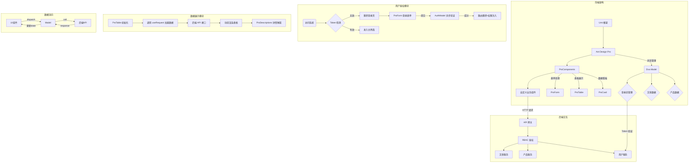

```mermaid
graph TD
    subgraph 前端架构
        A[Umi 框架] --> B[Ant Design Pro]
        B --> C[ProComponents]
        C --> D[自定义业务组件]
        
        B -->|状态管理| E(Dva Model)
        E --> F{登录态管理}
        E --> G{文章数据}
        E --> H{产品数据}
        
        C -->|表单处理| I[ProForm]
        C -->|表格展示| J[ProTable]
        C -->|数据看板| K[ProCard]
    end
    
    subgraph 后端交互
        L[API 网关] --> M[RBAC 鉴权]
        M --> N[文章服务]
        M --> O[产品服务]
        M --> P[用户服务]
    end
    
    D -->|HTTP 请求| L
    F -->|Token 验证| P
    
    subgraph 用户鉴权模块
        A1(访问系统) --> B1{Token 检测}
        B1 -->|无效| C1[跳转登录页]
        B1 -->|有效| D1[进入主界面]
        C1 --> E1[ProForm 登录表单]
        E1 -->|提交| F1[AuthModel 异步验证]
        F1 -->|成功| G1[路由跳转+权限注入]
    end
    
    subgraph 数据展示模块
        H1[ProTable 初始化] --> I1[调用 useRequest 加载数据]
        I1 --> J1[后端 API 接口]
        J1 --> K1[动态渲染表格]
        K1 --> L1[ProDescriptions 详情弹窗]
    end
    
    subgraph 数据流向
        UI组件 -->|dispatch| Model
        Model -->|call| 后端API
        后端API -->|response| Model
        Model -->|更新state| UI组件
    end
```
