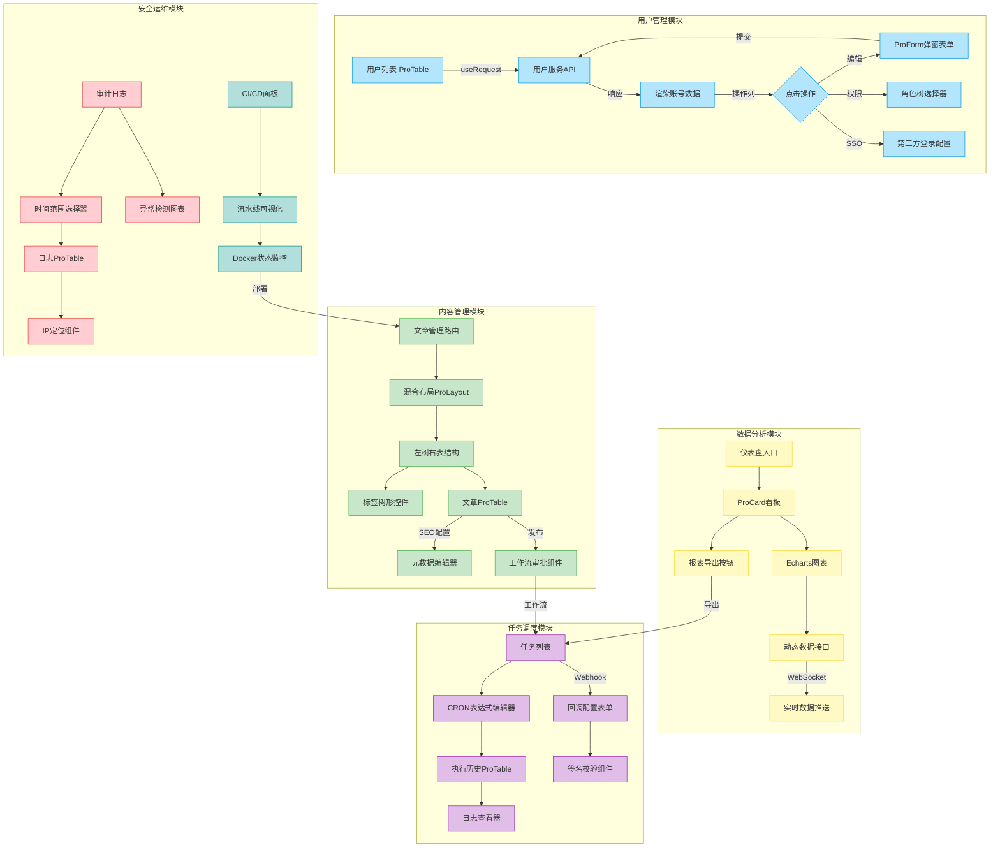

```mermaid
graph TD
    classDef user fill:#B3E5FC,stroke:#039BE5;
    classDef content fill:#C8E6C9,stroke:#4CAF50;
    classDef analysis fill:#FFF9C4,stroke:#FDD835;
    classDef task fill:#E1BEE7,stroke:#9C27B0;
    classDef security fill:#FFCDD2,stroke:#E53935;
    classDef ops fill:#B2DFDB,stroke:#009688;

    subgraph 用户管理模块
        A1[用户列表 ProTable] -->|useRequest| A2[用户服务API]
        A2 -->|响应| A3[渲染账号数据]
        A3 -->|操作列| A4{点击操作}
        A4 -->|编辑| A5[ProForm弹窗表单]
        A4 -->|权限| A6[角色树选择器]
        A4 -->|SSO| A7[第三方登录配置]
        class A1,A2,A3,A4,A5,A6,A7 user
    end

    subgraph 内容管理模块
        B1[文章管理路由] --> B2[混合布局ProLayout]
        B2 --> B3[左树右表结构]
        B3 --> B4[标签树形控件]
        B3 --> B5[文章ProTable]
        B5 -->|SEO配置| B6[元数据编辑器]
        B5 -->|发布| B7[工作流审批组件]
        class B1,B2,B3,B4,B5,B6,B7 content
    end

    subgraph 数据分析模块
        C1[仪表盘入口] --> C2[ProCard看板]
        C2 --> C3[Echarts图表]
        C3 --> C4[动态数据接口]
        C4 -->|WebSocket| C5[实时数据推送]
        C2 --> C6[报表导出按钮]
        class C1,C2,C3,C4,C5,C6 analysis
    end

    subgraph 任务调度模块
        D1[任务列表] --> D2[CRON表达式编辑器]
        D2 --> D3[执行历史ProTable]
        D3 --> D4[日志查看器]
        D1 -->|Webhook| D5[回调配置表单]
        D5 --> D6[签名校验组件]
        class D1,D2,D3,D4,D5,D6 task
    end

    subgraph 安全运维模块
        E1[审计日志] --> E2[时间范围选择器]
        E2 --> E3[日志ProTable]
        E3 --> E4[IP定位组件]
        E1 --> E5[异常检测图表]
        E6[CI/CD面板] --> E7[流水线可视化]
        E7 --> E8[Docker状态监控]
        class E1,E2,E3,E4,E5 security
        class E6,E7,E8 ops
    end

    A5 -->|提交| A2
    B7 -->|工作流| D1
    C6 -->|导出| D1
    E8 -->|部署| B1
```