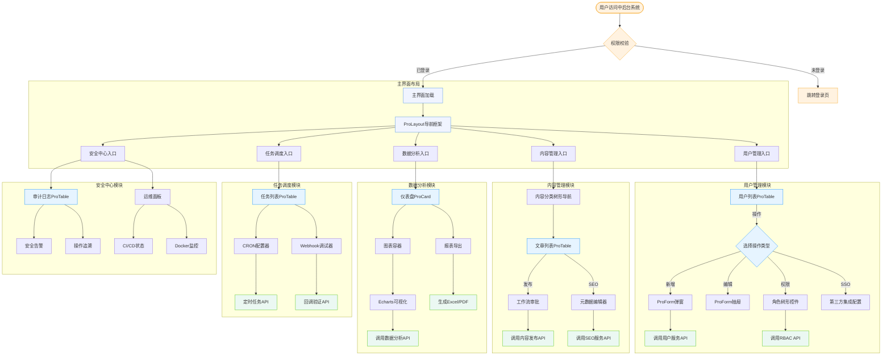

```mermaid
graph TD
    classDef module fill:#F0F4FF,stroke:#4A90E2;
    classDef action fill:#FFF2E0,stroke:#F5A623;
    classDef component fill:#E6F4FF,stroke:#1890FF;
    classDef api fill:#EBF8F2,stroke:#52C41A;

    A([用户访问中后台系统]) --> B{权限校验}
    B -->|已登录| C[主界面加载]
    B -->|未登录| D[跳转登录页]
    
    subgraph 主界面布局
        C --> E[ProLayout导航框架]
        E --> F1[用户管理入口]
        E --> F2[内容管理入口]
        E --> F3[数据分析入口]
        E --> F4[任务调度入口]
        E --> F5[安全中心入口]
    end
    
    subgraph 用户管理模块
        F1 --> G1[用户列表ProTable]
        G1 -->|操作| H1{选择操作类型}
        H1 -->|新增| I1[ProForm弹窗]
        H1 -->|编辑| I2[ProForm抽屉]
        H1 -->|权限| I3[角色树形控件]
        H1 -->|SSO| I4[第三方集成配置]
        I1 --> J1[调用用户服务API]
        I3 --> J2[调用RBAC API]
    end
    
    subgraph 内容管理模块
        F2 --> G2[内容分类树形导航]
        G2 --> H2[文章列表ProTable]
        H2 -->|发布| I5[工作流审批]
        H2 -->|SEO| I6[元数据编辑器]
        I5 --> J3[调用内容发布API]
        I6 --> J4[调用SEO服务API]
    end
    
    subgraph 数据分析模块
        F3 --> G3[仪表盘ProCard]
        G3 --> H3[图表容器]
        H3 --> I7[Echarts可视化]
        I7 --> J5[调用数据分析API]
        G3 --> H4[报表导出]
        H4 --> J6[生成Excel/PDF]
    end
    
    subgraph 任务调度模块
        F4 --> G4[任务列表ProTable]
        G4 --> H5[CRON配置器]
        G4 --> H6[Webhook调试器]
        H5 --> J7[定时任务API]
        H6 --> J8[回调验证API]
    end
    
    subgraph 安全中心模块
        F5 --> G5[审计日志ProTable]
        G5 --> H7[安全告警]
        G5 --> H8[操作追溯]
        F5 --> G6[运维面板]
        G6 --> H9[CI/CD状态]
        G6 --> H10[Docker监控]
    end

    class A,B,D action;
    class C,E module;
    class G1,H1,H2,G3,G4,G5 component;
    class J1,J2,J3,J4,J5,J6,J7,J8 api;
```