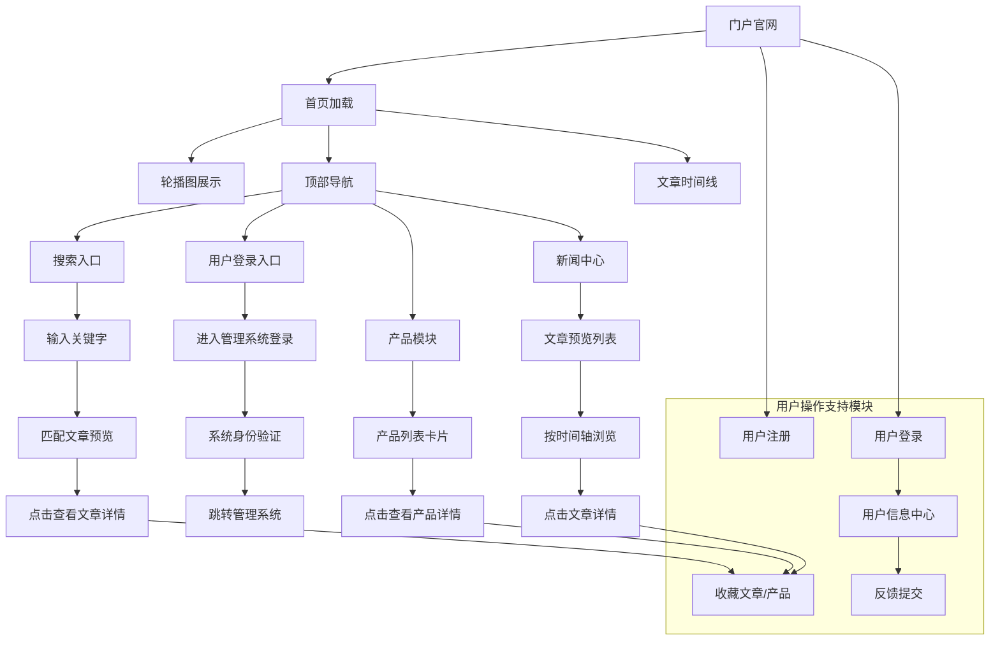

```mermaid
flowchart TD
    A[门户官网] --> B[首页加载]
    B --> C1[轮播图展示]
    B --> C2[顶部导航]
    B --> C3[文章时间线]
    C2 --> D1[搜索入口]
    C2 --> D2[用户登录入口]
    C2 --> D3[产品模块]
    C2 --> D4[新闻中心]

    D1 --> E1[输入关键字]
    E1 --> F1[匹配文章预览]
    F1 --> G1[点击查看文章详情]

    D2 --> E2[进入管理系统登录]
    E2 --> F2[系统身份验证]
    F2 --> G2[跳转管理系统]

    D3 --> E3[产品列表卡片]
    E3 --> F3[点击查看产品详情]

    D4 --> E4[文章预览列表]
    E4 --> F4[按时间轴浏览]
    F4 --> G3[点击文章详情]

    subgraph 用户操作支持模块
        H1[用户注册]
        H2[用户登录]
        H3[用户信息中心]
        H4[收藏文章/产品]
        H5[反馈提交]
    end

    G1 & G3 & F3 --> H4
    A --> H1
    A --> H2
    H2 --> H3
    H3 --> H5


```