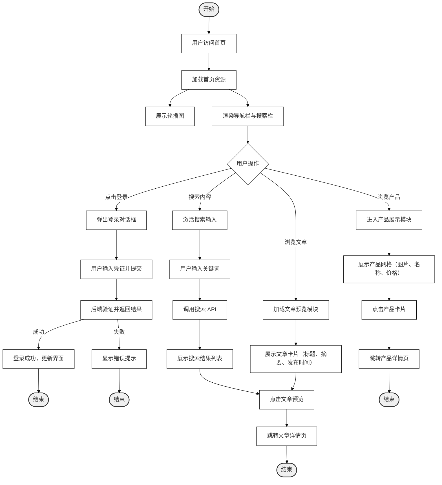

```mermaid
%%{init: {'theme': 'base', 'themeVariables': { 'primaryColor': '#ffffff', 'nodeBorder': '#000000' }}}%%

%%{init: {'theme': 'base', 'themeVariables': { 'primaryColor': '#ffffff', 'nodeBorder': '#000000' }}}%%

flowchart TD
    Start([开始]) --> A[用户访问首页]
    
    A --> B[加载首页资源]
    B --> C[展示轮播图]
    B --> D[渲染导航栏与搜索栏]

    D --> E{用户操作}
    E -- 点击登录 --> F[弹出登录对话框]
    F --> G[用户输入凭证并提交]
    G --> H[后端验证并返回结果]
    H -- 成功 --> I[登录成功，更新界面] --> End1([结束])
    H -- 失败 --> J[显示错误提示] --> End2([结束])

    E -- 搜索内容 --> K[激活搜索输入]
    K --> L[用户输入关键词]
    L --> M[调用搜索 API]
    M --> N[展示搜索结果列表]
    N --> O[点击文章预览]
    O --> P[跳转文章详情页] --> End3([结束])

    E -- 浏览文章 --> Q[加载文章预览模块]
    Q --> R[展示文章卡片（标题、摘要、发布时间）]
    R --> O

    E -- 浏览产品 --> S[进入产品展示模块]
    S --> T[展示产品网格（图片、名称、价格）]
    T --> U[点击产品卡片]
    U --> V[跳转产品详情页] --> End4([结束])

    classDef startEnd fill:#f0f0f0,stroke:#333,stroke-width:2px;
    class Start,End1,End2,End3,End4 startEnd;
```