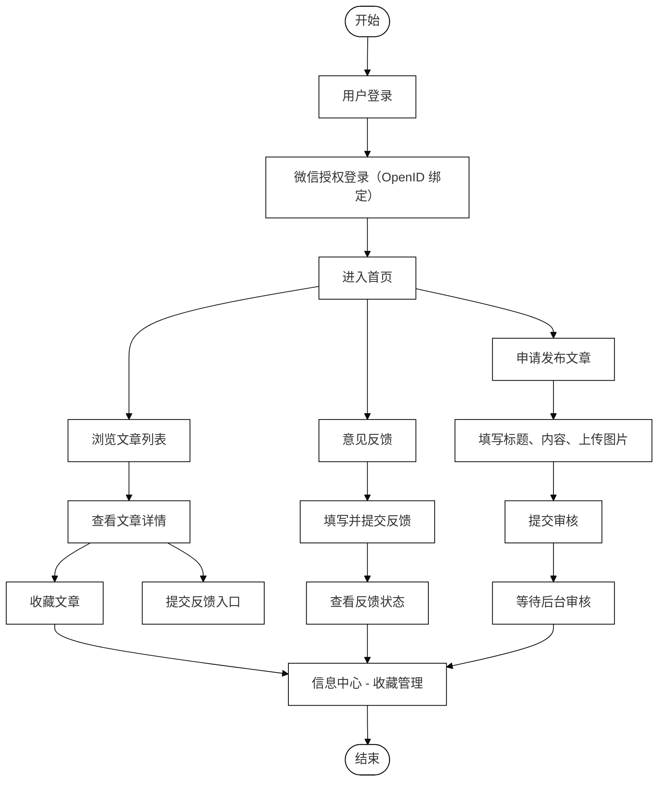

```mermaid
%%{init: {'theme': 'base', 'themeVariables': { 'primaryColor': '#ffffff', 'nodeBorder': '#000000' }}}%%

flowchart TD
  Start([开始])
  
  Start --> Login[用户登录]
  Login --> Auth[微信授权登录（OpenID 绑定）]
  Auth --> Dashboard[进入首页]

  Dashboard --> ViewArticles[浏览文章列表]
  ViewArticles --> ArticleDetail[查看文章详情]
  ArticleDetail --> CollectArticle[收藏文章]
  ArticleDetail --> FeedbackEntry[提交反馈入口]

  Dashboard --> Feedback[意见反馈]
  Feedback --> SubmitFeedback[填写并提交反馈]
  SubmitFeedback --> FeedbackStatus[查看反馈状态]

  Dashboard --> ApplyArticle[申请发布文章]
  ApplyArticle --> FillForm[填写标题、内容、上传图片]
  FillForm --> SubmitArticle[提交审核]
  SubmitArticle --> AwaitApproval[等待后台审核]

  CollectArticle --> PersonalCenter[信息中心 - 收藏管理]
  FeedbackStatus --> PersonalCenter
  AwaitApproval --> PersonalCenter

  PersonalCenter --> End([结束])


```