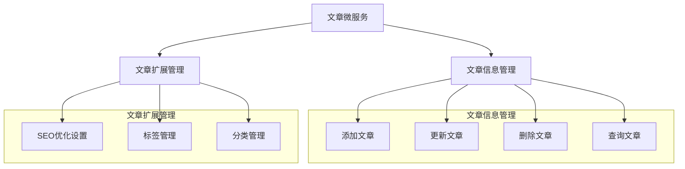

```mermaid
flowchart TD
    A[文章微服务]
    
    subgraph 文章信息管理
        B1[添加文章]
        B2[更新文章]
        B3[删除文章]
        B4[查询文章]
    end
    
    subgraph 文章扩展管理
        C1[SEO优化设置]
        C2[标签管理]
        C3[分类管理]
    end

    A --> B[文章信息管理]
    B --> B1
    B --> B2
    B --> B3
    B --> B4

    A --> C[文章扩展管理]
    C --> C1
    C --> C2
    C --> C3

```