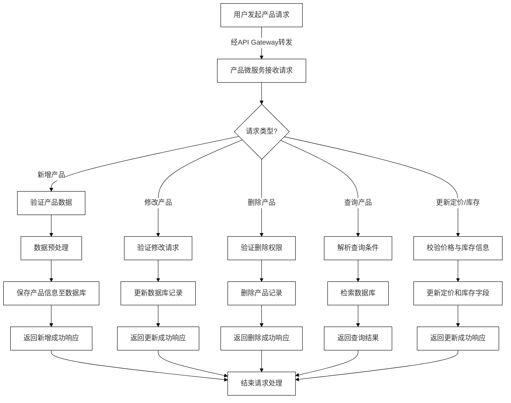

```mermaid
%%{init: {'theme': 'base', 'themeVariables': { 'primaryColor': '#ffffff', 'nodeBorder': '#000000' }}}%%

flowchart TD
    Start[用户发起产品请求]
    Start -->|经API Gateway转发| Dispatch[产品微服务接收请求]
    Dispatch --> Decision{请求类型?}
    
    Decision -->|新增产品| Validate[验证产品数据]
    Validate --> Process[数据预处理]
    Process --> Save[保存产品信息至数据库]
    Save --> Resp1[返回新增成功响应]
    
    Decision -->|修改产品| ValidateUpdate[验证修改请求]
    ValidateUpdate --> ProcessUpdate[更新数据库记录]
    ProcessUpdate --> Resp2[返回更新成功响应]
    
    Decision -->|删除产品| CheckAuth[验证删除权限]
    CheckAuth --> Delete[删除产品记录]
    Delete --> Resp3[返回删除成功响应]
    
    Decision -->|查询产品| ParseQuery[解析查询条件]
    ParseQuery --> Search[检索数据库]
    Search --> Resp4[返回查询结果]
    
    Decision -->|更新定价/库存| ValidateStock[校验价格与库存信息]
    ValidateStock --> UpdateStock[更新定价和库存字段]
    UpdateStock --> Resp5[返回更新成功响应]
    
    Resp1 & Resp2 & Resp3 & Resp4 & Resp5 --> End[结束请求处理]

```