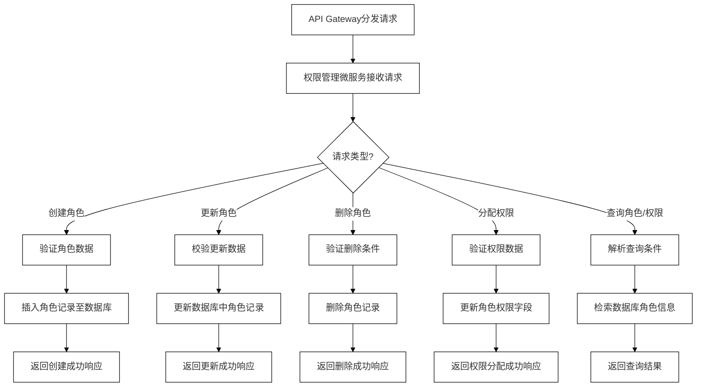

```mermaid
%%{init: {'theme': 'base', 'themeVariables': { 'primaryColor': '#ffffff', 'nodeBorder': '#000000' }}}%%

flowchart TD
    A[API Gateway分发请求] --> B[权限管理微服务接收请求]
    B --> C{请求类型?}
    
    C -- "创建角色" --> D[验证角色数据]
    D --> E[插入角色记录至数据库]
    E --> F[返回创建成功响应]
    
    C -- "更新角色" --> G[校验更新数据]
    G --> H[更新数据库中角色记录]
    H --> I[返回更新成功响应]
    
    C -- "删除角色" --> J[验证删除条件]
    J --> K[删除角色记录]
    K --> L[返回删除成功响应]
    
    C -- "分配权限" --> M[验证权限数据]
    M --> N[更新角色权限字段]
    N --> O[返回权限分配成功响应]
    
    C -- "查询角色/权限" --> P[解析查询条件]
    P --> Q[检索数据库角色信息]
    Q --> R[返回查询结果]

```