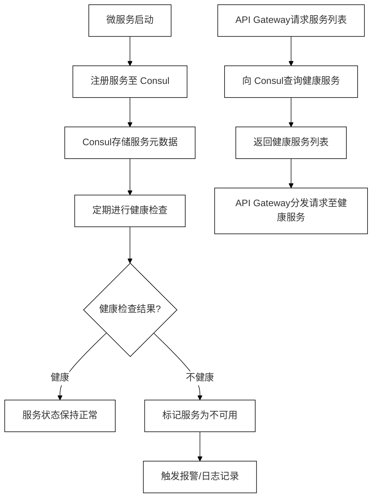

```mermaid
%%{init: {'theme': 'base', 'themeVariables': { 'primaryColor': '#ffffff', 'nodeBorder': '#000000' }}}%%

flowchart TD
    A[微服务启动] --> B[注册服务至 Consul]
    B --> C[Consul存储服务元数据]
    C --> D[定期进行健康检查]
    
    D --> E{健康检查结果?}
    E -- 健康 --> F[服务状态保持正常]
    E -- 不健康 --> G[标记服务为不可用]
    
    H[API Gateway请求服务列表] --> I[向 Consul查询健康服务]
    I --> J[返回健康服务列表]
    J --> K[API Gateway分发请求至健康服务]
    
    G --> L[触发报警/日志记录]

```