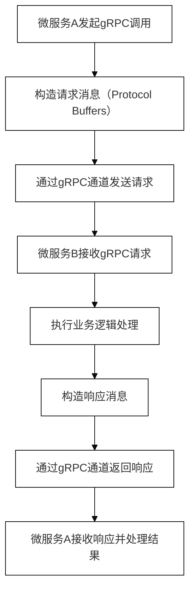

```mermaid
%%{init: {'theme': 'base', 'themeVariables': { 'primaryColor': '#ffffff', 'nodeBorder': '#000000' }}}%%
flowchart TD
    A[微服务A发起gRPC调用] --> B[构造请求消息（Protocol Buffers）]
    B --> C[通过gRPC通道发送请求]
    C --> D[微服务B接收gRPC请求]
    D --> E[执行业务逻辑处理]
    E --> F[构造响应消息]
    F --> G[通过gRPC通道返回响应]
    G --> H[微服务A接收响应并处理结果]

```