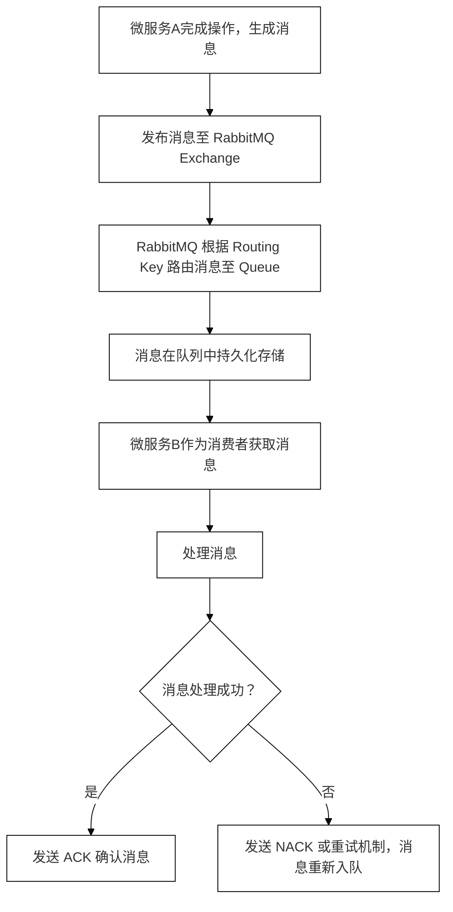

```mermaid
%%{init: {'theme': 'base', 'themeVariables': { 'primaryColor': '#ffffff', 'nodeBorder': '#000000' }}}%%

flowchart TD
    A[微服务A完成操作，生成消息] --> B[发布消息至 RabbitMQ Exchange]
    B --> C[RabbitMQ 根据 Routing Key 路由消息至 Queue]
    C --> D[消息在队列中持久化存储]
    D --> E[微服务B作为消费者获取消息]
    E --> F[处理消息]
    F --> G{消息处理成功？}
    G -- 是 --> H[发送 ACK 确认消息]
    G -- 否 --> I[发送 NACK 或重试机制，消息重新入队]

```