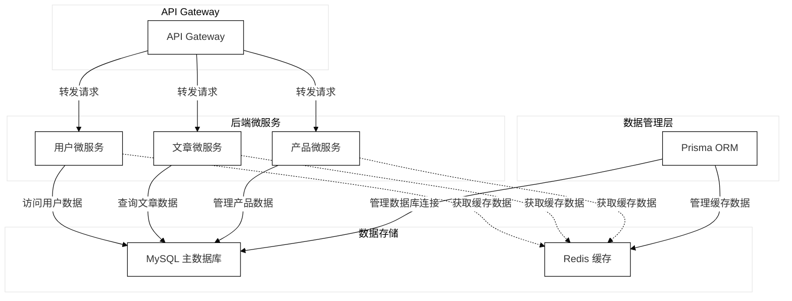

```mermaid
%%{init: {'theme': 'base', 'themeVariables': { 'primaryColor': '#ffffff', 'nodeBorder': '#000000' }}}%%

graph TD
    subgraph 数据存储
        A[MySQL 主数据库]
        B[Redis 缓存]
    end

    subgraph 数据管理层
        D[Prisma ORM]
    end

    subgraph 后端微服务
        E[用户微服务]
        F[文章微服务]
        G[产品微服务]
    end

    subgraph API Gateway
        H[API Gateway]
    end

    %% 数据交互流程
    E -->|访问用户数据| A
    F -->|查询文章数据| A
    G -->|管理产品数据| A

    E -.->|获取缓存数据| B
    F -.->|获取缓存数据| B
    G -.->|获取缓存数据| B

    D -->|管理数据库连接| A
    D -->|管理缓存数据| B

    H -->|转发请求| E
    H -->|转发请求| F
    H -->|转发请求| G

```