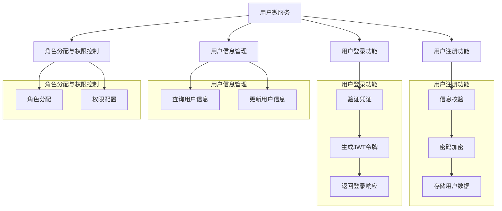

```mermaid
flowchart TD
    A[用户微服务]
    
    subgraph 用户注册功能
        B1[信息校验]
        B2[密码加密]
        B3[存储用户数据]
    end
    
    subgraph 用户登录功能
        C1[验证凭证]
        C2[生成JWT令牌]
        C3[返回登录响应]
    end
    
    subgraph 用户信息管理
        D1[查询用户信息]
        D2[更新用户信息]
    end
    
    subgraph 角色分配与权限控制
        E1[角色分配]
        E2[权限配置]
    end

    A --> B[用户注册功能]
    B --> B1
    B1 --> B2
    B2 --> B3

    A --> C[用户登录功能]
    C --> C1
    C1 --> C2
    C2 --> C3

    A --> D[用户信息管理]
    D --> D1
    D --> D2

    A --> E[角色分配与权限控制]
    E --> E1
    E --> E2


```