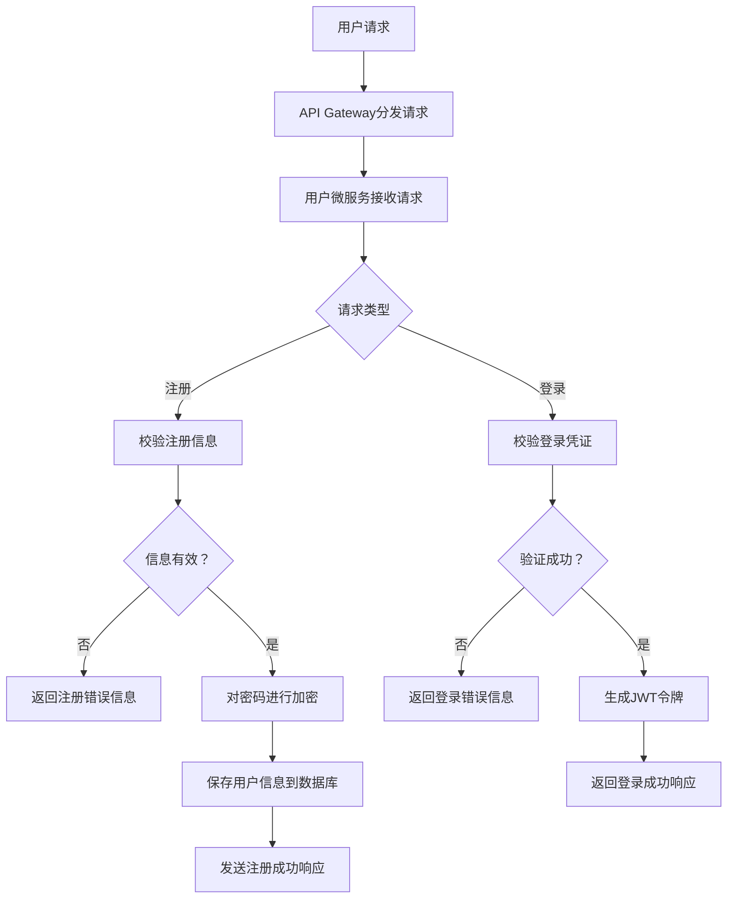

```mermaid
flowchart TD
    A[用户请求] --> B[API Gateway分发请求]
    B --> C[用户微服务接收请求]
    C --> D{请求类型}
    
    %% 注册流程
    D -- 注册 --> E[校验注册信息]
    E --> F{信息有效？}
    F -- 否 --> G[返回注册错误信息]
    F -- 是 --> H[对密码进行加密]
    H --> I[保存用户信息到数据库]
    I --> J[发送注册成功响应]
    
    %% 登录流程
    D -- 登录 --> K[校验登录凭证]
    K --> L{验证成功？}
    L -- 否 --> M[返回登录错误信息]
    L -- 是 --> N[生成JWT令牌]
    N --> O[返回登录成功响应]


```