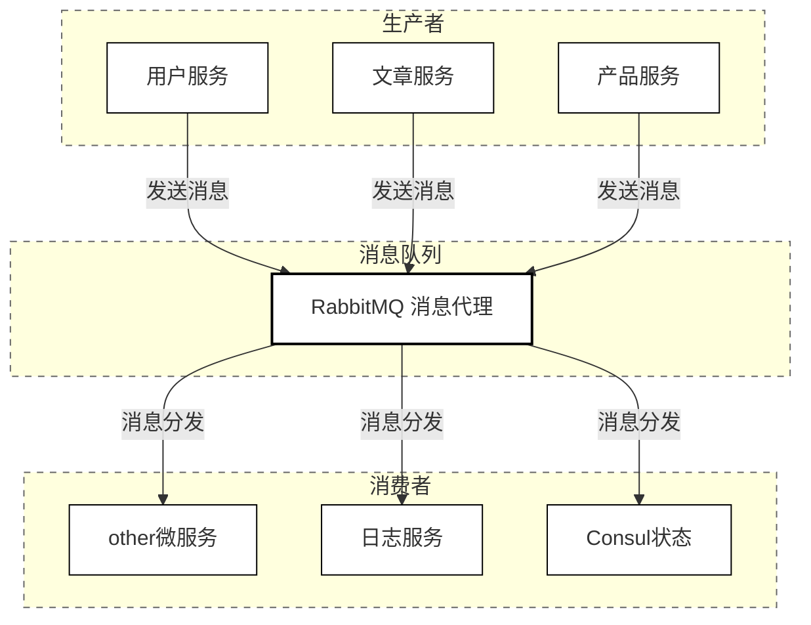

```mermaid
graph TD
    subgraph 消息队列
        A[RabbitMQ 消息代理]
    end

    subgraph 生产者
        B[用户服务]
        C[文章服务]
        D[产品服务]
    end

    subgraph 消费者
        E[other微服务]
        F[日志服务]
        G[Consul状态]
    end

    style A stroke:#000,stroke-width:2px
    style B stroke:#000
    style C stroke:#000
    style D stroke:#000
    style E stroke:#000
    style F stroke:#000
    style G stroke:#000

    B -->|发送消息| A
    C -->|发送消息| A
    D -->|发送消息| A

    A -->|消息分发| E
    A -->|消息分发| F
    A -->|消息分发| G

    classDef default fill:#fff,stroke:#000;
    classDef subgraphStyle stroke:#666,stroke-dasharray:5 5;
    class 消息队列,生产者,消费者 subgraphStyle;
```