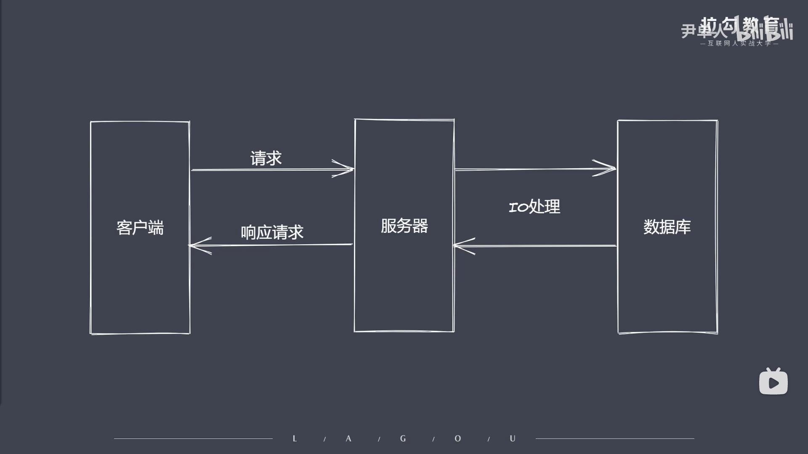
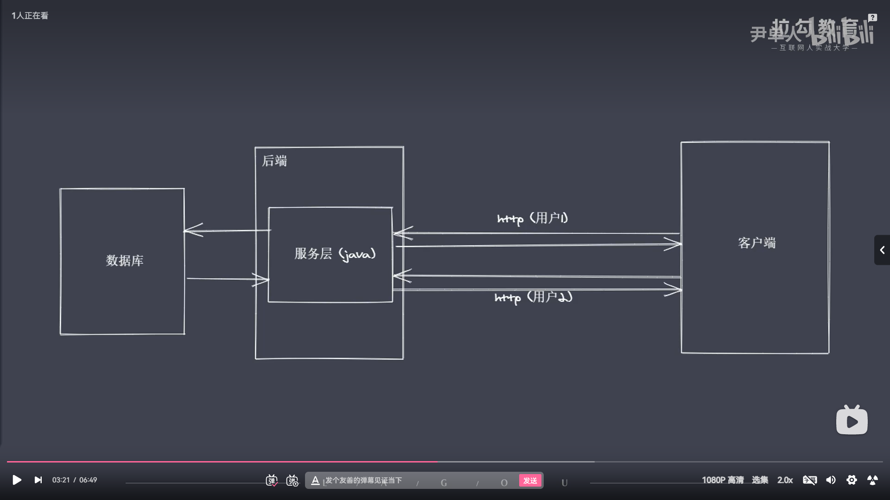

### Nodejs慢慢演化为一门服务端'语言' 为什么？

## BS（浏览器/服务端）架构下演示



```js
// 是因为nodejs的 Reactor模式，单线程完成多线程的工作(餐厅点餐模型)
 /* 
    当有多名客人点餐的时候，
    我们的服务员就需要等待客人完成点餐我们才能去进行点餐处理，
    这会导致我们大多时间浪费在等待客人点餐的过程上，
    而Nodejs的Reactor模式，
    就是将等待客人点餐的过程，
    放到一个单独的线程中，
    让服务员继续进行对其他客人的服务，
    当客人点餐完成后，
    再去呼叫服务员进行点餐处理即可，
    这就是Reactor思想，这也是我们为什么说Nodejs是服务端语言的原因(为什么能脱颖而出)。
 */
```