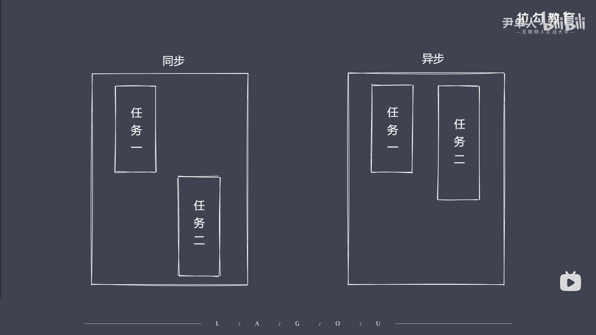
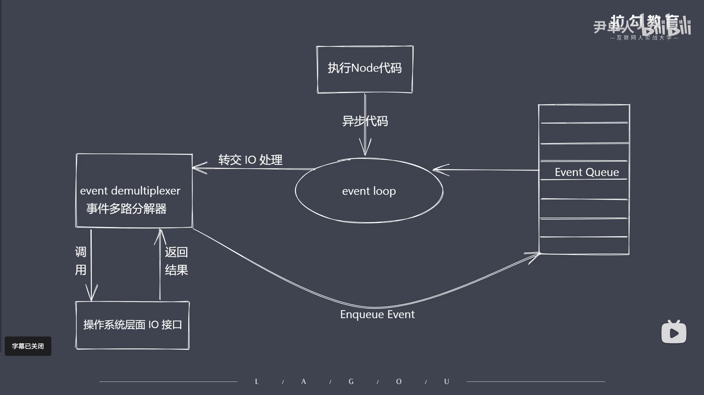

### 异步IO带来的好处
```js
/* 
    假设有两个需要执行的任务（1和2）
    ·同步执行：任务2可能需要等待任务1执行完毕后才能执行
    ·异步执行：任务2不需要等待任务1执行完毕，可以同时执行
*/
```


### Nodejs异步IO的实现

## 异步IO说明
```js
// 对于操作系统来说，IO只有阻塞和非阻塞（意思为我们当前是否能够立即获取到调用之后所返回的结果）
/* 
    所以对于上面所说的非阻塞IO，实际上就是可以把等待返回结果的时间拿去处理其他事物
    // 但是因为立即非阻塞IO立即返回的结果并不是我们想要的真实数据（仅是当前的状态），所以为了得到真实数据操作系统会让应用程序重复调用IO操作（从而去确认IO操作是否已经完成...这种操作也叫做轮询）-常见轮询技术read、select、poll、kqueue、event ports
    // 实际上如果依靠轮询，那么就会导致CPU的100%占用（结果还是同步的效果），所以Nodejs为了解决这个问题，引入了异步IO（libuv库-这个库就是异步IO实现的抽象封装）
    // 截图为异步IO的实现原理
*/
```

<!-- 解释： event loop 是事件循环又称消息发布器
            event demultiplexer 是事件多路分解器
            Enqueue Event 是将事件放入到事件队列中
            event Queue 是事件队列  
 -->
```js
/* 
    其意义可以理解为，我们每次使用异步IO时必须要有一个回调函数，当IO操作完成时，
    libuv库会调用这个回调函数（将该任务放入到线程池中）【如果是网络IO那么会去调用相应的操作系统层的IO接口来进行处理，如果是文件IO则会被放入nodejs自行实现的线程池】，
    通过'事件循环'一直去处理'事件队列'中的任务，
    当线程池中的任务全部执行完毕，libuv库会调用回调函数，通知应用程序IO操作已经完成

    当然这个事件循环不是一个无限循环的机制，当他发现队列中完全没有需要等待执行的任务的时候，他就会退出循环，然后等待下一次事件触发（相当于异步IO完成）
*/
```
