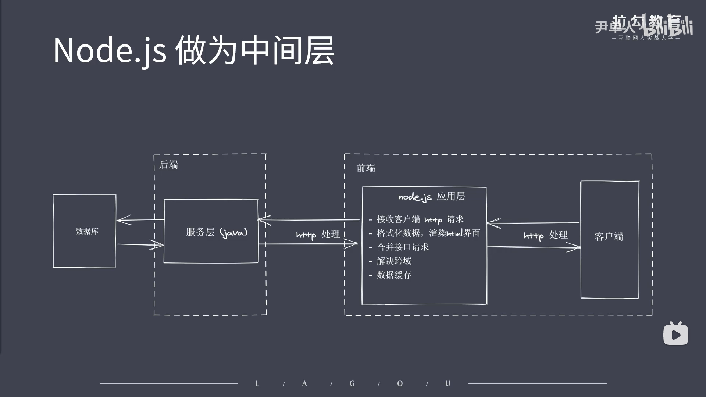

### Nodejs作为一个处于前端和后端的中间层(BFF层)
```js
/* 
    其含义为为前端开发的后端服务：
        BFF可以认为是一种适配服务，
        将后端的微服务进行适配（主要包括聚合裁剪和格式适配等逻辑），
        向无线端设备暴露友好和统一的API，
        方便无线设备接入访问后端服务。 
*/
```


```js
/* 
    ①接收客户端HTTP请求
    ②格式化数据，渲染HTML界面
    ③合并接口请求
    ④解决跨域
    ⑤数据缓存
*/
```

```js
/* 
    如果将Nodejs作为后端语言来看：
    ①我们在不去关注大量业务逻辑的前提下，可以使用Nodejs直接去操作数据库，这样就可以很容易的搭建出高效轻量的API服务
    ②可以搭建实时聊天应用程序
    ③在不过分的涉及业务处理的前提下，Nodejs能做很多事情（适合IO密集型的应用）
*/
``` 