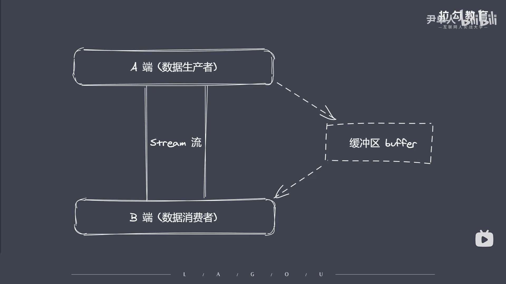

```js
// Buffer缓存区
/* 
    ①Buffer让JS可以操作二进制
    ②Buffer是什么？ 在哪里？ 做什么？
    ③二进制数据 、 流操作 、 Buffer

    ④JS语言起初服务于浏览器平台，所以只认识字符串。Nodejs平台下JS可以实现IO(IO行为操作的就是二进制数据)

    ⑤Stream流操作并非Nodejs独创，可以将其理解为流是一种数据类型和字符串数组相似，但它可以分段。这样可以避免操作的数据内存过大而出现的短时间内将内存占满的情况。

    ⑥流操作配合管道实现大数据分段传输。
    
    ⑦数据的端到端传输会有生产者和消费者（可能会出现生产数据 > 消费数据的情况，反之亦然）。导致生产和消费的过程往往存在等待。那产生等待的数据存放在哪里呢?这时候就有了Buffer(这就是Buffer存在的意义)

    ⑧Nodejs中Buffer是一片内存空间（该内存空间是特殊的，因为Nodejs最后的代码都由V8引擎所解释。一般来说这片空间是数据V8的堆内存，但这片空间不占据V8的堆内存(实际上是操作系统分配的内存)）

    ⑨Buffer是Nodejs的一个全局变量，无需require引入。
     实现Nodejs平台下的二进制数据的操作
     不占据V8堆内存大小的内存空间
     内存的使用由Node来控制，由V8的GC回收
     一般配合Stream流使用，充当数据缓冲区
*/
```

