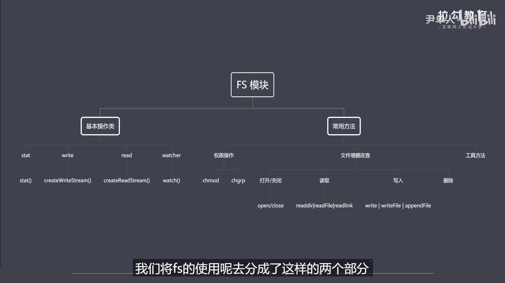
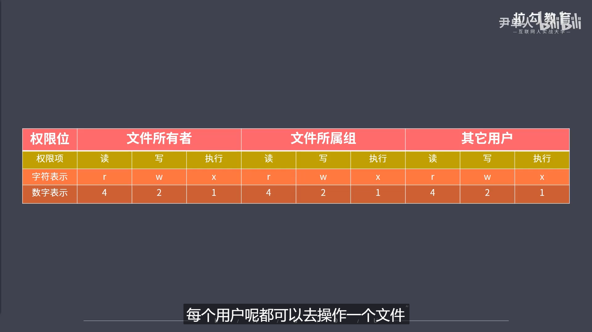

```js
// 核心模块fs
/* 
    ①缓冲区 数据流
    ②Buffer、Stream与FS有什么关系？
    ③FS是？ FS是内置核心模块，提供文件系统操作的API
*/
```

```js
// FS分为两部分
/* 
    ①FS基本操作类 (信息获取：当前是目录或文件？) (文件可读流和可写流操作) (文件的监听行为)
    ②FS常用API (文件的打开和关闭、增删改查等...)
*/
```

```js
// 文件操作前置知识
/*
    ①权限位：用户对于文件所具备的操作权限rwx(读 写 执行),一般以八进制数字(3字节二进制)表示 
    ②标识符(flag)：表示对文件的操作方式
    //
        r可读 w可写 s同步
        +表示执行相反操作(比如r+就是可读写)
        x 表示排他
        a 表示追加
    //
    ③文件描述符:
    //
        当一个文件被打开的时候，操作系统会自动分配一个文件标识符FD。文件操作就可以通过这个标识符来追踪特定的文件。而Nodejs专门去抽象了不同操作系统之间的差异，为所有打开的文件分配了数值的文件描述符。在Nodejs中每操作一个文件，文件描述符就会增加一次。文件描述符一般从3开始，0和1是标准输入输出2标准错误。
    //
*/
```
