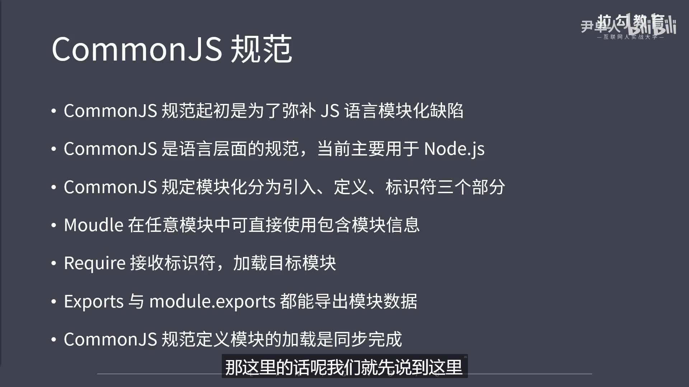

```js
// CommonJS规范
/* 
    ①它的出现是为了弥补JS语言没有模块化标准的缺陷
    ②它的出现也是为了让浏览器做出改变，从而实现JS代码可以到处运行，具备开发大型应用的能力。但由于浏览器本身的特点(例如说：数据需要通过网络来进行传输，而且存在单线程阻塞的加载方式)，因此让CommonJS规范不能应用于浏览器平台
    所以目前适合应用于Nodejs当中
    ③CommonJS是语言层面上的规范，模块化只是这个规范中的一部分


    它是如何定义模块化操作的？
    //
        ①模块应用
        ②模块定义
        ③模块标识
    //


    Nodejs与CommonJS
    //
        ①任意一个文件就是一个模块，具有独立作用域
        ②使用require导入其他模块
        ③将模块ID传入require实现目标模块定位
        ④Nodejs与CommonJS API之间的关联：
           module属性：
            任意JS文件是一个模块，可以直接使用module属性 
            id：返回模块标识符，一般是一个绝对路径
            filename:返回文件模块的绝对路径    
            loaded:返回布尔值，表示模块是否完成加载
            parent:返回对象存放调用当前模块的模块
            children:返回数组，存放当前模块调用的其他模块
            exports：返回当前模块需要暴露的内容
            paths:返回数组，存放不同目录下的node_modules位置
        ⑤module.exports与exports有何区别？
            1.exports是module.exports的快捷方式都指向modle.exports空间变量
            2.不能对exports进行赋值，否则不能再作为一个导出的接口使用
        ⑥require属性
            //
                1.基本功能是读入并且执行一个模块文件，返回这个模块文件里的exports对象，如果找不到该模块文件则报错。
                2.resolve：返回模块文件绝对路径
                3.extensions:依据不同后文件后缀名来调用不同的执行函数最后来解析我们传入的模块文件
                4.main:返回主模块对象(就是入口们见)   
            //
    //

    总结：
*/
```
