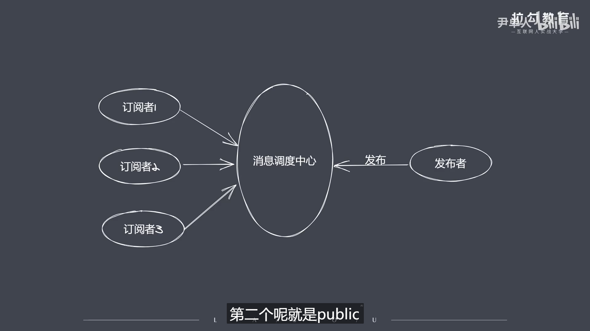

```js
// 发布订阅模式
/* 
    ①发布订阅模式是一个模型
    ②定义了对象间一对多的依赖关系,不同对象之间实现了解耦.可以做到完全不认识彼此
    ③发布订阅可以解决什么问题?
        由于语言本身的特性.在我们实现一个具体需求的时候可能会连续的使用到多个异步操作的API.
        如果这些API的调用互相依赖彼此执行的结果这个时候就会产生很多的回调嵌套.在没有promise之前是很难解决的
        而发布订阅模式就能很好的解决问题

    ④通过图片可以看出.发布订阅和观察者模式最明显的不同点就是调度中心的存在.调度中心实现了订阅者和发布者的完全解耦(对应到Nodejs中它就是Eventloop消息队列)

    ⑤工作流程: 1.订阅者把自己想订阅的事件监听注册到调度中心 2.等到事件被触发之后,发布者就会把这个事件发布到调度中心  3.之后再由调度中心统一的去调度订阅者之前所注册的处理代码

    ⑥要实现图片上的内容我们需要分这几步: 1.我们需要有一个缓存队列.用来存放订阅者的细信息
                                      2.发布者需要具备一定的能力.如增加和删除订阅者
                                      3.当发布者状态改变时通知所有订阅者
*/
```
