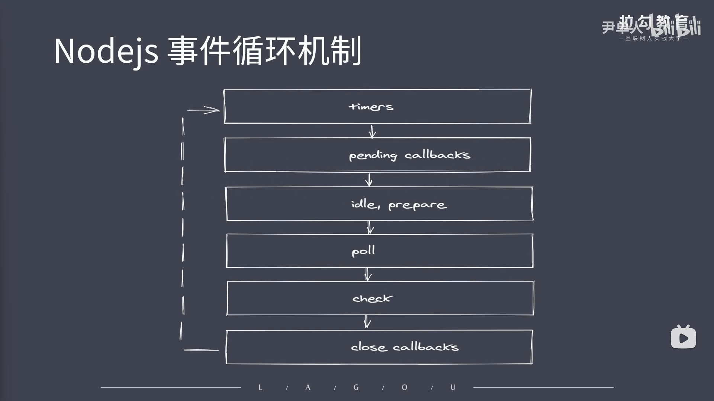

```js
// Nodejs时间循环机制
/* 
    ①跟浏览器平台不同。浏览器分为宏任务和微任务队列
    ②Nodejs分成了六个队列。(每个队列中存放的都是回调函数)
    ③队列存放说明：
        1.timers：执行setTimeout和setInterval回调
        2.pending callbacks：z执行系统操作的回调，例如TCP、UDP等...
        3.idle,prepare:只在系统内部进行使用
        4.poll：执行与IO相关的回调
        5.check：执行setImmediate中的回调
        6.close callbacks:执行close事件的回调
    ④完整事件环： 1.执行同步代码，将不同的任务添加至相应的队列
                 2.执行完整个同步代码完成后，就去执行满足条件的微任务(Nodejs中也存在微任务队列跟上面提到的六个队列没有任何联系)
                 3.所有微任务完成后会执行timer队列中满足的宏任务
                 4.timer中的所有宏任务完成后就会依次切换队列
                 5.注意：在完成队列之前会先清空微任务代码（微任务代码执行的时机：在所有同步代码完成后会先清空一次微任务代码，切换下一个队列之前还会清空一次）
*/
```
