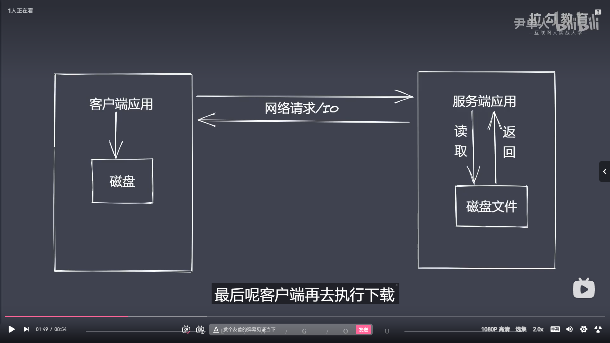
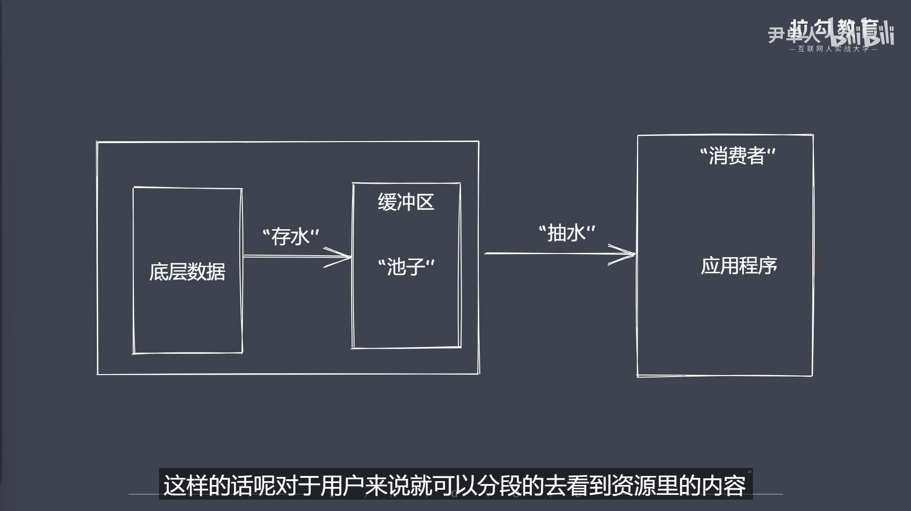
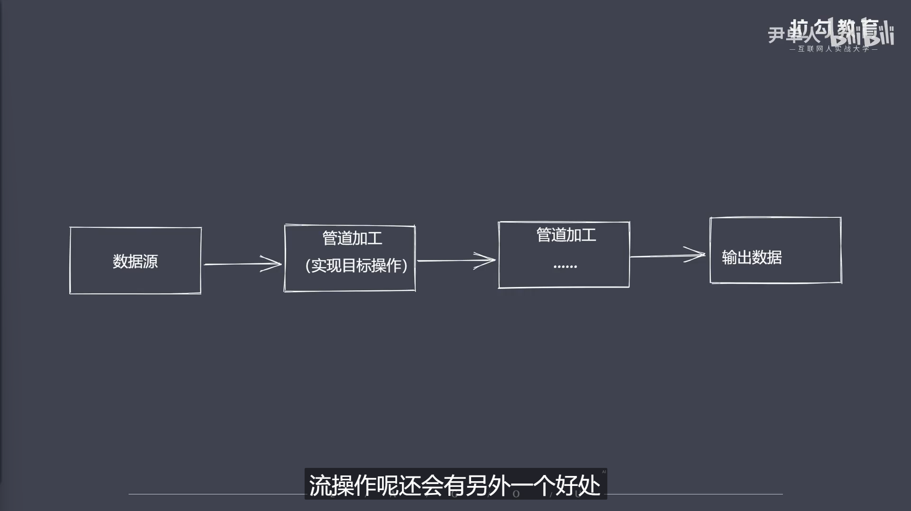

```js
// 核心模块之Stream 流操作
/* 
    ①Nodejs诞生就是为了提高IO性能
    ②文件操作系统和网络模块实现了流接口

    ③Nodejs中的流就是处理流式数据的抽象接口(其实就是拿流来解释流)
    ④应用程序为什么需要使用流来处理数据?
     -比如我们观看一部大型电影
    
    ⑤常见问题:
    -同步读取资源文件,用户需要等待数据读取完成
    -资源文件最终一次性加载至内存中,开销较大

    ⑥解决问题:
    -分段的处理大型数据
    -将数据源经过管道后进行加工操作再输出数据

    时间效率:流的分段处理可以同时操作多个数据chunk(数据块)
    空间效率:同一时间流无须占据大内存空间
    使用方便:;流配合管道,扩展程序变得简单

    Nodejs内置了Stream:(实现流操作对象)
    -Readable:可读流,能过实现数据获取
    -Writable:可写流,能过实现数据的写操作
    -Duplex:双工流,既可读又可写
    -Transform:转换流,可读可写,还能实现数据转换

    补充说明:
    -上述4个类型都是具体的抽象,可以理解为类.如果想要实现自己的流,需要继承抽象类.然后重写抽象类中的方法(必须)
    -所有流都继承自EventEmitter类
*/
```


