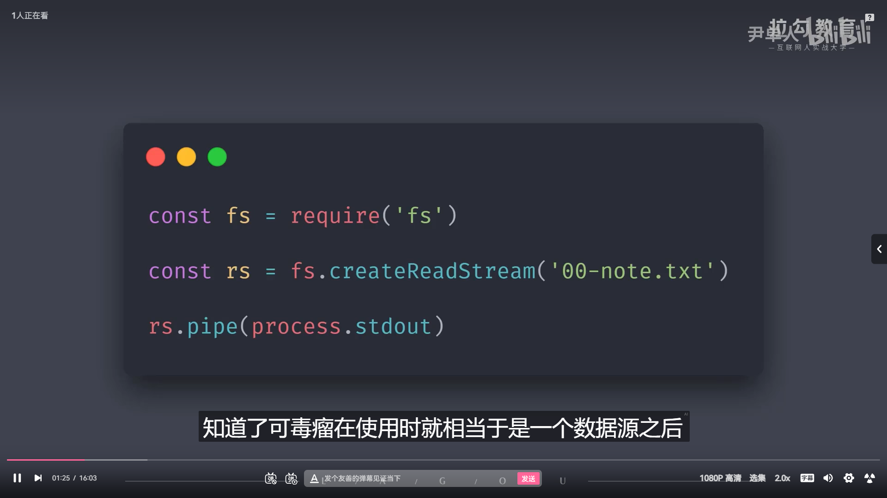
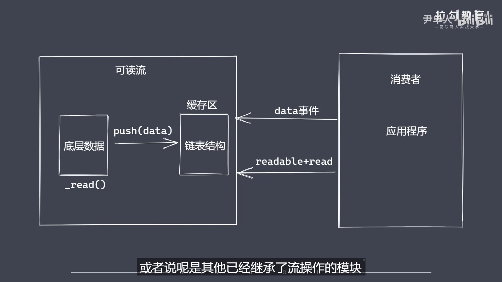

```js
// 可读流
/* 
    ①是'生产供程序消费数据的流'.最常见的生产方式就是读取磁盘文件或网络请求里的内容

    ②自定义可读流
    -继承Stream里的readable
    -重写_read方法调用push产出数据(push操作是推到缓冲区,这个缓冲区是一个链表结构)

    ③自定义可读流问题:底层数据读取完成之后如何处理?消费者如何获取可读流中的数据?

    ④解决方法:
    -在底层数据被读完后,我们可以给push方法传递一个null值,这时候内部实现就知道底层的数据已经被完全读取完毕了
    -第二个问题:readable提供了两个事件.reable和data事件(为什么存在两个事件:主要是场景使用不同:比如有时只需要按需的读取一部分数据.
    有时候需要源源不断的完全读取数据)

    ⑤流动模式\暂停模式:

    ⑥消费数据:
    raadable事件:当流中存在可读取数据时触发
    data事件:当流中数据块传给消费者后触发

    ⑦总结:
    -明确数据生产于消费流程
    -利用API实现自定义的可读流
    -明确数据消费的事件使用

*/
```

