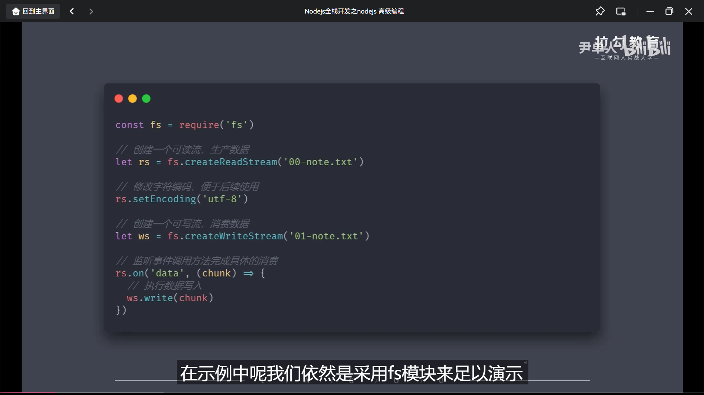
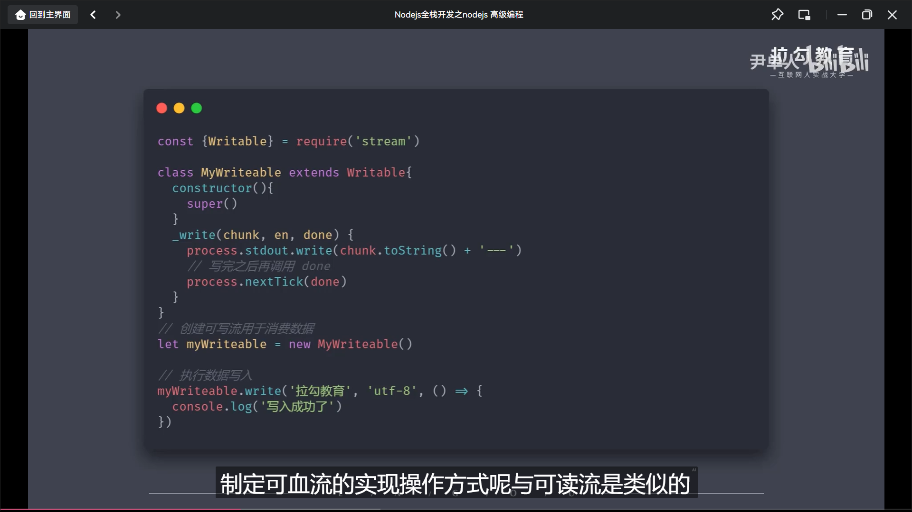

```js
// Nodejs 可写流
/* 
    ①用于消费数据,处于结构下流
    ②可写流的操作和可读流相反

    自定义可写流:
    -继承stream模块的Writable
    -重写_write方法,调用_write执行写入

    可写流事件:
    -pipe事件:可读流调用pipe()方法时触发
    / 
        当可读流调用pipe方法向可写流传输数据的时候就会触发可写流pipe事件,从而完成最终的数据写入操作  
    /
    -unpipe事件:可读流调用时触发
    /
        用来切断数据的传输
    /
    -drain事件:它会在write()方法返回false,然后数据又继续写入的时候触发.这是使用流操作不会将内存撑爆的方法
    (工作原理为:write方法在执行的时候,会判断当前写入的数据量是否小于当前流中设置的缓存大小上限,如果小于上限,则返回true,如果大于上限,则返回false)
*/
```

