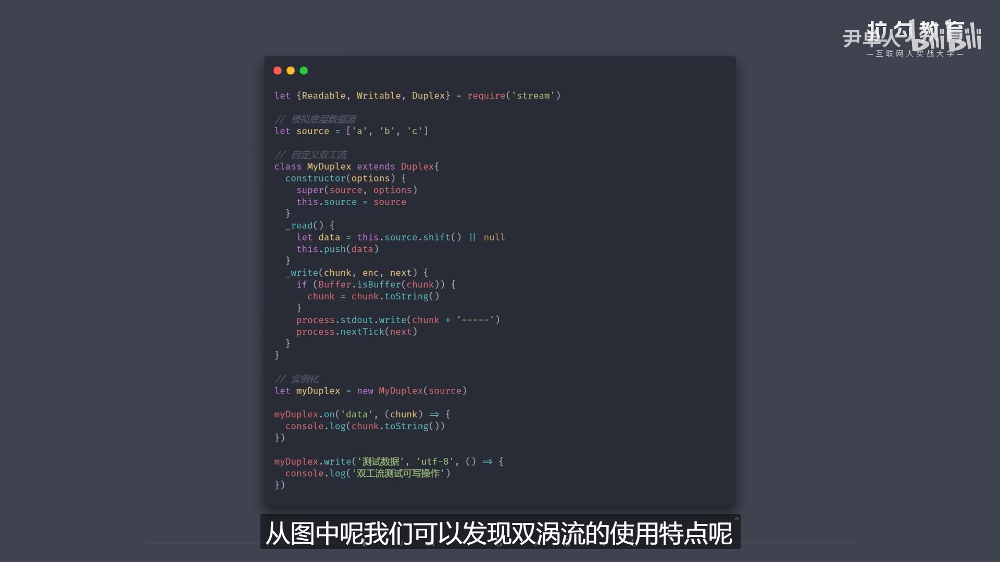
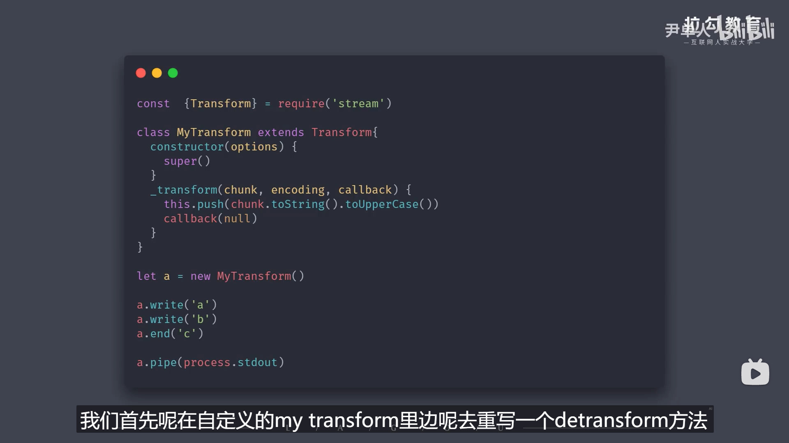

```js
// 44.stream之双工流和转换流
/* 
    ①声明:Nodejs中stream是流操作的抽象接口集合
    ②可读\可写\双工\转换是单一抽象具体实现
    ③流操作的核心功能就是处理数据
    ④Nodejs的诞生就是为了解决密集型IO事务
    ⑤Nodejs中处理数据模块继承了流和EventEmitter
    ⑥实际开发中我们是直接使用某个继承stream操作的模块,而不是制定某个流操作然后再使用
    那么清楚这些之后我们就明白stream\四种类型流\实现流操作的模块之间的关系了
    
    1.duplex是双工流,既能生产和消费流
    /
        自定义双工流:
        -继承Duplex类
        -重写_read方法,调用push生产数据
        -重写_write方法,调用write消费数据
    /

    2.Transform(转换流)也是一个双工流(但是duplex中的读和写是相互独立的:它的读操作是不能够被写操作来直接当做数据源去使用.但是Transform可以)
    /
        -也就是说,转换流的底层是将读写操作进行了联通
        -转换流还可以对数据执行相应的转换操作(这里的相应是我们自己定义的)
        自定义转换流:
        -继承Transform类
        -重写_transform方法,调用push和callback
        -重写_flush方法,处理剩余数据
    /

    总结:Nodejs中的四种流
    -readable可读流 
    /
        这是一个专门生产数据的操作,常见消费方法是监听readable和data事件.
        其中readable是需要我们主动调用read方法去消费数据的
        data是一种流动的模式,它会一直去读.暂停和流动之间是可以相互切换的
    /

    -Writeable可写流
    /
        这是一个专门消费数据的流,主要方式就是调用write方法,然后再去把数据源里的数据写到指定的位置中
    /

    -Duplex双工流
    /
        即可读又可写,但两者之间相互独立
    /

    -Transform转换流
    /
        是一种双工流,两者之间互通,并且可以自定义处理数据的方式
    /
*/
```

