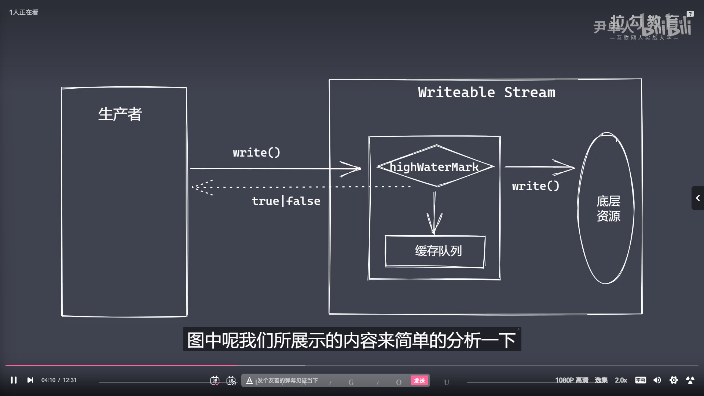

```js
// 背压机制其实就是：
/* 
    1.Nodejs中的Stream已经实现了背压机制：以保证数据平滑流动
    2.它解决了什么问题？原理是怎么实现的？

    24.png这张图片：
    ①该操作看似无问题：其实存在，读取速度大于写入速度。出现产能过剩，这时readable内部维护了一个队列。
    当它不能实时的消费由上游传输过来的数据时，它就会尝试把不能消化掉的数据缓冲到队列中。但是这个队列也是有大小的。如果不去实现一个背压机制，很有可能出现 内存溢出、GC频繁调用、其他进程变慢
*/
```



