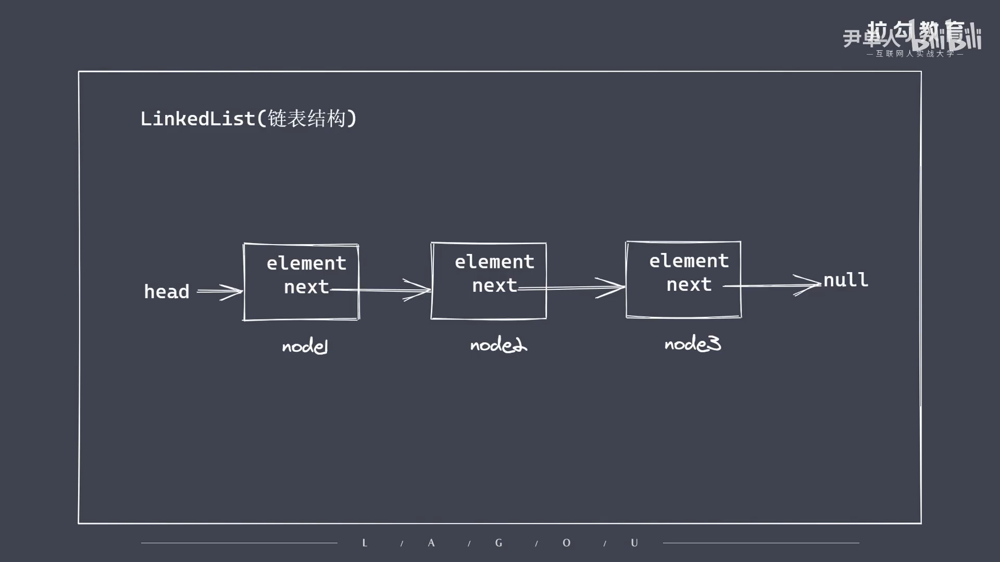

```js
// 52.链表结构
/* 
    ①为了存储多个排列数据。为什么使用链表？使用链表不适用数组
    ②相对于以下：
        -数组存储数据的长度具有上限
        -数组在插入或删除操作的时候都会移动数据，造成塌陷问题
        -JS中数组被实现成了对象。效率对于链表太低
    ③链表是一系列节点（Node节点）的集合，每个节点都具有指向下一个节点的引用
    ④常见列表分类：
        -双向链表
        -单向链表
        -循环链表
*/
```
