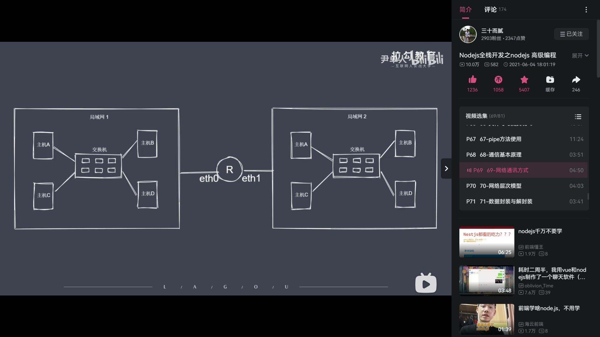

```js
// 网络通讯方式
/* 
    如何建立多台设备连接？
    -通过交换机，形成网络（局域网）
    
    交换机如何定位两台想要通讯的设备？
    -通过mac（物理地址）地址来唯一标识一台主机
    -一台主机通过广播的形式发送数据包，那个知道是发送给自己的主机接收数据包。其他主机舍弃掉。
    -交换机接口数量有限，所有有其他交换机形成局域网。局域网间互联变成互联网。局域网间的互联通过路由器实现：当一个局域网内的主机想要去访问另一个局域网的主机时，需要通过路由器转发这就要知道这个主机的网卡(Mac)地址还要知道它在那个网络（IP地址）里
    -局域网存在大量主机会造成广播风暴
*/
```
