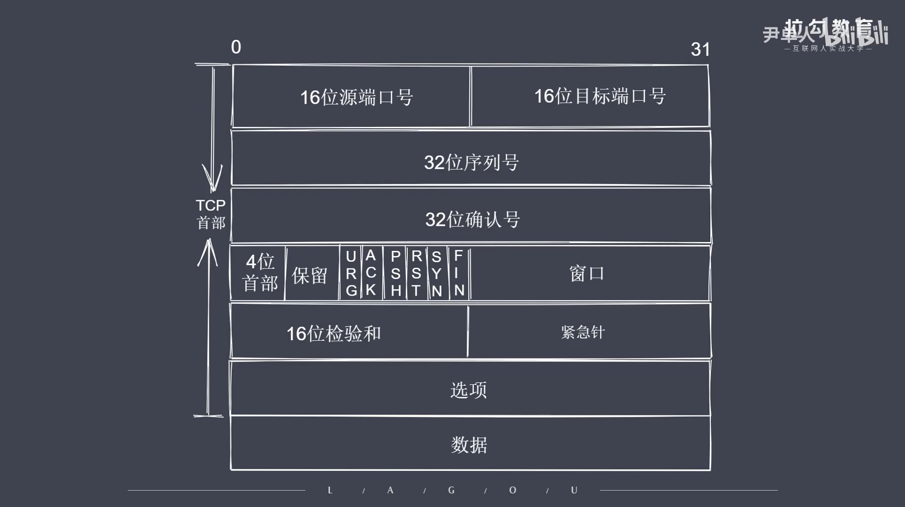
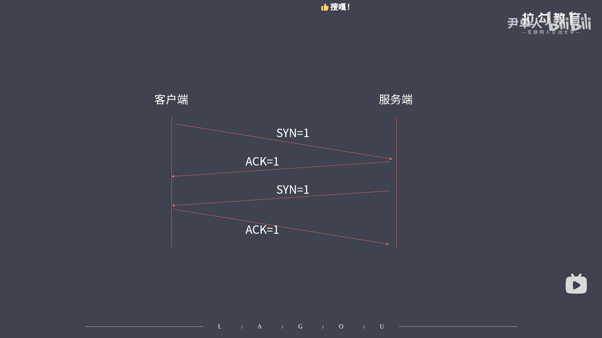
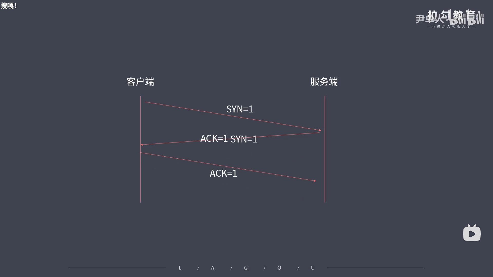
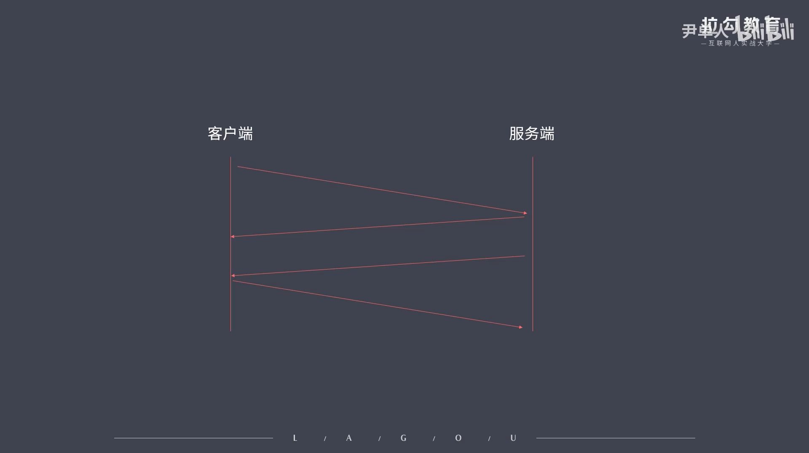

```js
// 61.TCP三次握手和四次挥手
/* 
    ①只探究建立过程，底层逻辑不探究

    TCP协议：
    -TCP属于传输协议
    -TCP协议是面向连接的，需要建立连接才能通信
    -TCP用于处理实时通信
    -常见控制字段：
        SYN = 1表示请求连接
        FIN = 1表示关闭连接
        ACK = 1表示数据信息确认

    为什么不能将四次挥手中的第一次确认断开和第二次请求断开合并？
        因为一个服务端服务于多个客户端，服务端不能保证某个客户端发送请求后就能立即将结果数据传输回当前的客户端。

    总结：
        ·TCP处于传输层，基于端口，面向连接
        ·主机之间要想通信需要先建立双向数据通道
        ·TCP的握手和挥手本质都是四次
*/
```



