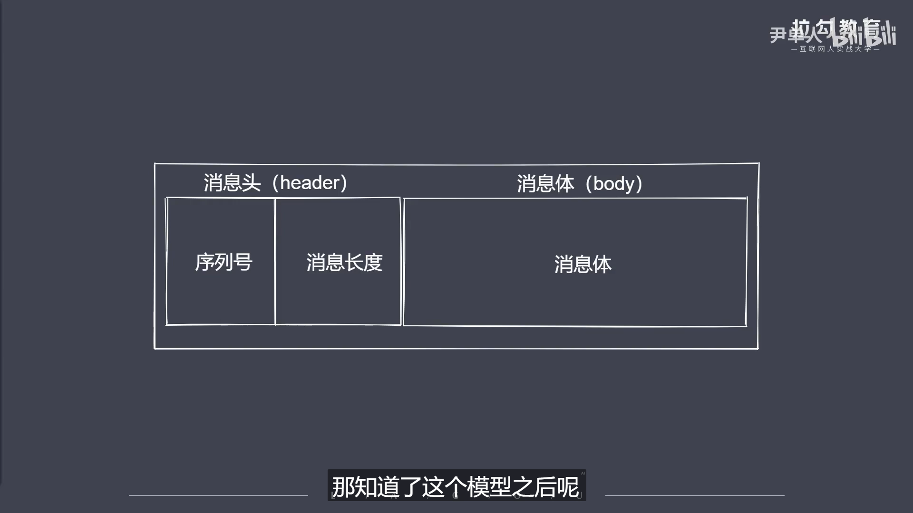

```js
// 64.数据的封包和拆包实现
/* 
    ①使用数据封包，再拆包机制实现解决粘包问题
    ②其实就是按照约定好的规则打包数据，使用数据时在进行拆包。
    ③我们这里使用长度编码来约定通信方式

    长度编码数据传输过程:
    -人为的进行数据编码，获取二进制数据包(将数据封装成包)
    -按规则拆解数据，获取指定长度的数据(数据接收端)
    ·通过上诉，我们就需要用到Buffer数据读写了。
        -writeInt16BE:将value从指定位置写入(写入操作) 
        -readInt16BE:从指定位置读取数据(读取操作)
*/
```
